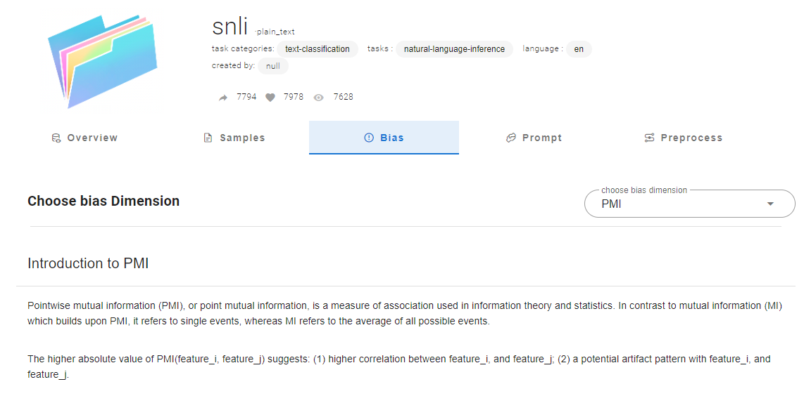

# How to Identify Artifacts of using DataLab?

The basic idea of artifact identification is to use PMI (Pointwise mutual information) to detect whether there
is an association between **TWO** features (e.g., sentence length v.s category).

For example, given two feature_i, and feature_j, a higher absolute value of PMI(feature_i, feature_j) 
suggests: (1) higher association between feature_i, and feature_j; (2) a potential artifact pattern with feature_i, and feature_j 
(e.g., longer sentences tend to have a positive sentiment.)

In this section, we take [`snli`](http://datalab.nlpedia.ai/normal_dataset/617794bfb7314cb4146d2384/dataset_bias) dataset 
as one example and walk through how to identify potential artifacts of a dataset using DataLab.

### Step 1: Enter into Bias analysis page
Select the dataset and enter into its functional panel page, click the `Bias` button

### Step 2: Select Two Feature Fields

Before selecting two specific features, we should first select a `field`. What is the `field`?
It is the basic unit of the sample. For example, in natural language inference task, the `field` could be `premise` and `hypothesis`.
In text summarization task, the `field` could be `source` and `summary`.

### Step 3: Select Two features
Features are properties defined w.r.t the data of each field. For example,
the `text length` could be a feature of the field `hypothesis`.

### Step 4: Interpret Results
Once we finished the above three steps, a visualized PMI matrix will be printed automatically:

For example, in the above matrix, value in entry (i,j) represents the PMI(i,j).
and `8.4~12.1 (count:10883)` represents there are 10883 samples whose hypothesis lengths are in [8.4,12.1].

One tip here is we can examine the entries with higher absolute value of PMI (i.e., darker color), suggesting a potential artifact pattern.

For each entry, you also can see a floating text box. For example, in this example, suppose that
x = `hypothesis length` satisfies [8.4, 12.1],
y = `category label` is neutral
N = `the number of all samples`: 50000

we have:

* p(x) = n(x)/N = 10883/50000  (n(x))
* p(y) = n(x)/N = 16525/50000
where n(x) represents the number of samples with feature x.
We define
* `actual number` as the actual number of samples with features x and y: N * P(x,y) 
* `ideal count` as the number of samples with features x and y who are independent: N * P(x) * P(y)
* `PMI` = log p(x,y)/(p(x)p(y))

Then for each entry of the matrix, we can see one floating text box, showing following statistics:
* `label` (neutral): one feature
* `hypothesis_length` (8.4~12.1): another feature
* `actual count`: the actual number of samples whose `label` is neutral and `hypothesis_length` is in [8.4~12.1].
* `ideal count`: the ideal number of samples whose `label` is neutral and `hypothesis_length` is in [8.4~12.1].
* `overrepresented`: the ratio between `actual count` and `ideal count`.
* `PMI`: the PMI value  

From this PMI matrix, we can observe that:
* when the length of hypothesis is larger than 8.4, PMI(label_neutral,length_hypothesis) >0.28, suggesting that “long hypotheses” tend to co-occur with 
  the “neutral” label regardless of what the premises are.
* when length_hypothesis ∈ [1,4.7], PMI(label_entailment,length_hypothesis) = 0.359, implying that “short hypotheses” tend to co-occur 
  with the label “entailment”. 
Interestingly, the above observations are exactly consistent with those of the work [Annotation Artifacts in Natural Language Inference Data](https://arxiv.org/pdf/1803.02324.pdf)

The above is just one example, and we can identify more potential artifacts in a similar way based on different features provided by DataLab.
